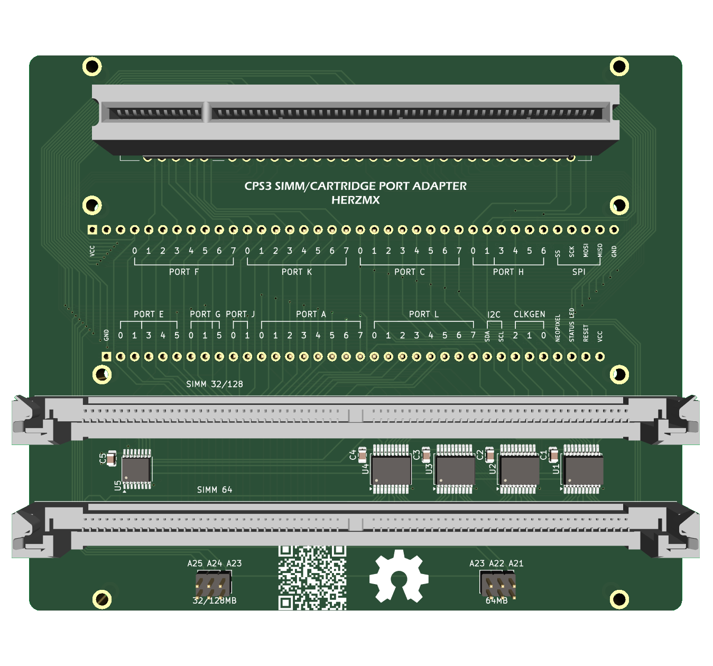

# CPS3 SIMM/CARTRIDGE PORT ADAPTER for OSCR

The purpose of this adapter is to provide additional methods for reading and writing CP System III cartridges and SIMM memories, utilizing the excellent open-source project [Open Source Cartridge Reader (OSCR)](https://github.com/herzmx/cartreader/).

You can enable module uncomenting **ENABLE_CPS3**, **ENABLE_FLASH8** and **ENABLE_FLASH16** in Confing.h . While the R/W implementation in OSCR is not as fast as standard flash memory programmers, it allows you to dump and flash new data without needing to desolder the flash memories from the cartridge or SIMMs.

In this version, patches have been added to change the region and CD/NOCD options, based on documented dumps from MAME.

## Compatibility

### Cartridge

You can read and write the **BIOS** from a cartridge using Fujitsu MBM29F400TC (0x0423) or MBM29F400BC (0x0422) Flash ROMs.

If you flash or write a previously dumped BIOS, as documented in the MAME [cps3.cpp](https://github.com/mamedev/mame/blob/master/src/mame/capcom/cps3.cpp), the following patches can be applied:

- Region patch
- CD/NOCD patch

**Note:** This has only been tested on *Street Fighter III: 2nd Impact* and the *Ultra BIOS*. Use it at your own risk when working with live cartridges.

### SIMM's

You can read and write from 32/128Mb and 64Mb SIMMs using Fujitsu MBM29F016A (0x04AD) Flash ROMs. While CPS3 systems support multiple models of Flash ROMs, I have only tested with the Fujitsu model. Below is a list of Flash ROM models registered in the BIOS, meaning you cannot replace Flash ROMs without modifying the BIOS.

| MODEL                 | DataSheet | Physical Access |
|-----------------------|-----------|-----------------|
| MXCI MX29F016         | YES       | NO              |
| SHARP LH28F016SU      | YES       | NO              |
| INTEL 28F016SA        | YES       | NO              |
| HITACHI HN98F1600T10  | NO        | YES             |

### 32/128Mb SIMMs

The SIMM is arranged as 2x8 bits across 4 banks, with each bank handling 4MB and accessing data in 16 bits. The adapter uses an LS139 to access each bank through addresses 21 and 22.

The dump is a complete 4MB/16MB file and matches with the set of files found inside the CD-ROM. For example, SIMM 3 in *Street Fighter III 2nd Impact* corresponds to files 30+31. You can compare or write data by joining these two files.

### 64Mb SIMMs

The SIMM is arranged as 4x8 bits and accesses data in 32 bits. The adapter uses an LS245 as a bus controller to access 16 bits at a time.

The dump is a complete 8MB file and matches with the set of files from the CD-ROM. For example, SIMM 1 in *Street Fighter III 2nd Impact* corresponds to file 10, so you can write this file directly.

## Disclaimer!!!

**I am not responsible for any damage to your CPS3 cartridges or SIMMs. At this time, it remains untested in live cartridges, so use it at your own risk!**

## License
 This work is licensed under a <a rel="license" href="http://creativecommons.org/licenses/by-sa/4.0/">Creative Commons Attribution-ShareAlike 4.0 International License</a>. You are able to copy and redistribute the material in any medium or format, as well as remix, transform, or build upon the material for any purpose (even commercial) - but you **must** give appropriate credit, provide a link to the license, and indicate if any changes were made.
